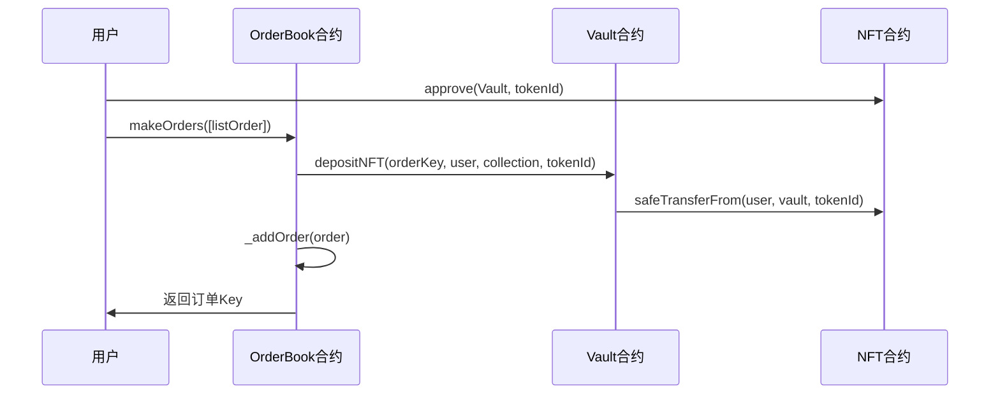
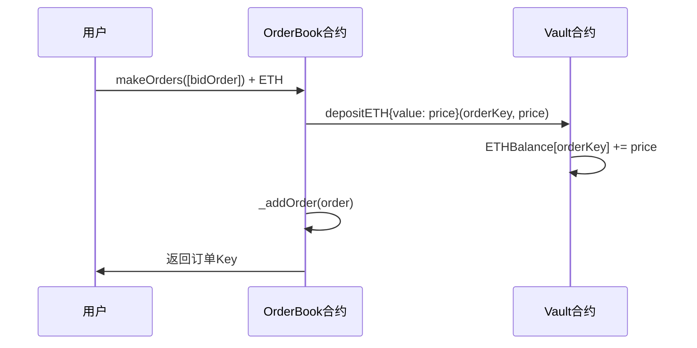
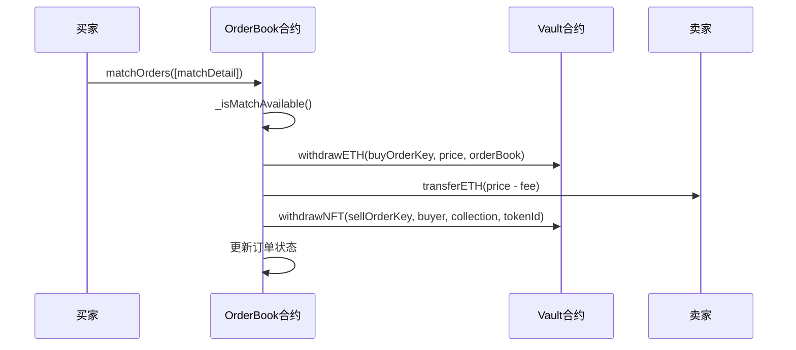

# EasySwap 合约详细分析

## 概述

EasySwap 是一个基于以太坊的 NFT 交易平台，采用订单簿模式进行 NFT 交易。系统由两个核心合约组成：
- **EasySwapOrderBook**: 订单管理合约，处理订单的创建、匹配、取消等操作
- **EasySwapVault**: 资产托管合约，负责 NFT 和 ETH 的存储和转移

---

## 1. EasySwapOrderBook 合约分析

### 1.1 合约架构

```solidity
contract EasySwapOrderBook is
    IEasySwapOrderBook,
    Initializable,
    ContextUpgradeable,
    OwnableUpgradeable,
    ReentrancyGuardUpgradeable,
    PausableUpgradeable,
    OrderStorage,
    ProtocolManager,
    OrderValidator
```

**继承关系：**
- `Initializable`: 支持代理模式升级
- `OwnableUpgradeable`: 所有权管理
- `ReentrancyGuardUpgradeable`: 重入攻击防护
- `PausableUpgradeable`: 紧急暂停功能
- `OrderStorage`: 订单存储逻辑
- `ProtocolManager`: 协议费用管理
- `OrderValidator`: 订单验证逻辑

### 1.2 核心功能

#### 1.2.1 订单创建 (makeOrders)

```solidity
function makeOrders(LibOrder.Order[] calldata newOrders)
    external
    payable
    override
    whenNotPaused
    nonReentrant
    returns (OrderKey[] memory newOrderKeys)
```

**功能说明：**
- 批量创建订单
- 支持两种订单类型：
  - **List 订单**: 出售 NFT，需要先授权 Vault 合约
  - **Bid 订单**: 购买 NFT，需要发送 ETH

**关键逻辑：**
```solidity
// 计算 Bid 订单的 ETH 金额
if (newOrders[i].side == LibOrder.Side.Bid) {
    buyPrice = Price.unwrap(newOrders[i].price) * newOrders[i].nft.amount;
}

// 将资产存入 Vault
if (order.side == LibOrder.Side.List) {
    IEasySwapVault(_vault).depositNFT(
        newOrderKey,
        order.maker,
        order.nft.collection,
        order.nft.tokenId
    );
} else if (order.side == LibOrder.Side.Bid) {
    IEasySwapVault(_vault).depositETH{value: uint256(ETHAmount)}(
        newOrderKey,
        ETHAmount
    );
}
```

#### 1.2.2 订单取消 (cancelOrders)

```solidity
function cancelOrders(OrderKey[] calldata orderKeys)
    external
    override
    whenNotPaused
    nonReentrant
    returns (bool[] memory successes)
```

**功能说明：**
- 批量取消订单
- 只有订单创建者可以取消
- 自动从 Vault 提取资产

**关键逻辑：**
```solidity
// 验证订单所有权和状态
if (order.maker == _msgSender() && 
    filledAmount[orderKey] < order.nft.amount) {
    
    // 从 Vault 提取资产
    if (order.side == LibOrder.Side.List) {
        IEasySwapVault(_vault).withdrawNFT(/*...*/);
    } else if (order.side == LibOrder.Side.Bid) {
        IEasySwapVault(_vault).withdrawETH(/*...*/);
    }
}
```

#### 1.2.3 订单编辑 (editOrders)

```solidity
function editOrders(LibOrder.EditDetail[] calldata editDetails)
    external
    payable
    override
    whenNotPaused
    nonReentrant
    returns (OrderKey[] memory newOrderKeys)
```

**功能说明：**
- 修改现有订单（主要是价格）
- 先取消旧订单，再创建新订单
- 处理 ETH 金额差异

#### 1.2.4 订单匹配 (matchOrders)

```solidity
function matchOrders(LibOrder.MatchDetail[] calldata matchDetails)
    external
    payable
    override
    whenNotPaused
    nonReentrant
    returns (bool[] memory successes)
```

**功能说明：**
- 批量匹配订单
- 支持两种匹配方式：
  - 接受现有的 Bid 订单（作为卖家）
  - 接受现有的 List 订单（作为买家）

**匹配验证：**
```solidity
function _isMatchAvailable(
    LibOrder.Order memory sellOrder,
    LibOrder.Order memory buyOrder,
    OrderKey sellOrderKey,
    OrderKey buyOrderKey
) internal view {
    require(sellOrder.side == LibOrder.Side.List && 
            buyOrder.side == LibOrder.Side.Bid, "HD: side mismatch");
    require(sellOrder.saleKind == LibOrder.SaleKind.FixedPriceForItem, 
            "HD: kind mismatch");
    require(sellOrder.maker != buyOrder.maker, "HD: same maker");
    // 检查资产匹配
    require(/* 资产匹配逻辑 */, "HD: asset mismatch");
}
```

### 1.3 费用机制

```solidity
function _shareToAmount(uint128 total, uint128 share) 
    internal pure returns (uint128) {
    return (total * share) / LibPayInfo.TOTAL_SHARE;
}

// 在匹配时收取协议费用
uint128 protocolFee = _shareToAmount(fillPrice, protocolShare);
sellOrder.maker.safeTransferETH(fillPrice - protocolFee);
```

---

## 2. EasySwapVault 合约分析

### 2.1 合约架构

```solidity
contract EasySwapVault is IEasySwapVault, OwnableUpgradeable {
    address public orderBook;
    mapping(OrderKey => uint256) public ETHBalance;
    mapping(OrderKey => uint256) public NFTBalance;
}
```

**核心状态变量：**
- `orderBook`: 订单簿合约地址
- `ETHBalance`: 每个订单的 ETH 余额
- `NFTBalance`: 每个订单的 NFT TokenID

### 2.2 核心功能

#### 2.2.1 ETH 管理

```solidity
function depositETH(OrderKey orderKey, uint256 ETHAmount) 
    external payable onlyEasySwapOrderBook {
    require(msg.value >= ETHAmount, "HV: not match ETHAmount");
    ETHBalance[orderKey] += msg.value;
}

function withdrawETH(OrderKey orderKey, uint256 ETHAmount, address to) 
    external onlyEasySwapOrderBook {
    ETHBalance[orderKey] -= ETHAmount;
    to.safeTransferETH(ETHAmount);
}
```

**功能说明：**
- 存储 Bid 订单的 ETH
- 只有 OrderBook 合约可以调用
- 支持精确的金额控制

#### 2.2.2 NFT 管理

```solidity
function depositNFT(OrderKey orderKey, address from, address collection, uint256 tokenId) 
    external onlyEasySwapOrderBook {
    IERC721(collection).safeTransferNFT(from, address(this), tokenId);
    NFTBalance[orderKey] = tokenId;
}

function withdrawNFT(OrderKey orderKey, address to, address collection, uint256 tokenId) 
    external onlyEasySwapOrderBook {
    require(NFTBalance[orderKey] == tokenId, "HV: not match tokenId");
    delete NFTBalance[orderKey];
    IERC721(collection).safeTransferNFT(address(this), to, tokenId);
}
```

**功能说明：**
- 存储 List 订单的 NFT
- 使用 `safeTransferNFT` 确保安全转移
- 验证 TokenID 匹配

#### 2.2.3 订单编辑支持

```solidity
function editETH(OrderKey oldOrderKey, OrderKey newOrderKey, 
                uint256 oldETHAmount, uint256 newETHAmount, address to) 
    external payable onlyEasySwapOrderBook {
    ETHBalance[oldOrderKey] = 0;
    if (oldETHAmount > newETHAmount) {
        ETHBalance[newOrderKey] = newETHAmount;
        to.safeTransferETH(oldETHAmount - newETHAmount);
    } else if (oldETHAmount < newETHAmount) {
        require(msg.value >= newETHAmount - oldETHAmount, "HV: not match newETHAmount");
        ETHBalance[newOrderKey] = msg.value + oldETHAmount;
    } else {
        ETHBalance[newOrderKey] = oldETHAmount;
    }
}
```

**功能说明：**
- 支持订单编辑时的资产转移
- 处理 ETH 金额增减
- 自动退款或要求补充资金

---

## 3. 系统工作流程

### 3.1 创建 List 订单流程



### 3.2 创建 Bid 订单流程



### 3.3 订单匹配流程



---

## 4. 安全机制

### 4.1 访问控制

```solidity
modifier onlyEasySwapOrderBook() {
    require(msg.sender == orderBook, "HV: only EasySwap OrderBook");
    _;
}

modifier onlyDelegateCall() {
    _checkDelegateCall();
    _;
}

function _checkDelegateCall() private view {
    require(address(this) != self);
}
```

### 4.2 重入攻击防护

```solidity
modifier nonReentrant {
    // OpenZeppelin 的重入保护
}
```

### 4.3 暂停机制

```solidity
modifier whenNotPaused {
    // 紧急情况下可以暂停合约
}
```

---

## 5. 数据结构

### 5.1 订单结构

```solidity
struct Order {
    Side side;           // List 或 Bid
    SaleKind saleKind;   // 销售类型
    address maker;       // 订单创建者
    Asset nft;          // NFT 信息
    Price price;        // 价格
    uint64 expiry;      // 过期时间
    uint64 salt;        // 随机数
}

struct Asset {
    uint256 amount;     // 数量
    address collection; // 合约地址
    uint96 tokenId;     // Token ID
}
```

### 5.2 订单键

```solidity
type OrderKey is bytes32;

// 通过订单哈希生成唯一键
function hash(Order memory order) internal pure returns (OrderKey) {
    return OrderKey.wrap(keccak256(abi.encode(order)));
}
```

---

## 6. 优势与特点

### 6.1 技术优势

1. **模块化设计**: 订单管理和资产托管分离
2. **批量操作**: 支持批量创建、取消、匹配订单
3. **升级支持**: 使用代理模式，支持合约升级
4. **Gas 优化**: 使用 delegatecall 减少 Gas 消耗

### 6.2 功能特点

1. **灵活定价**: 支持固定价格和集合出价
2. **订单编辑**: 可以修改现有订单
3. **费用管理**: 内置协议费用机制
4. **安全转移**: 使用 safeTransfer 确保 NFT 安全

### 6.3 用户体验

1. **简单接口**: 清晰的函数接口设计
2. **事件日志**: 完整的事件记录
3. **错误处理**: 详细的错误信息
4. **批量操作**: 提高操作效率

---

## 7. 潜在风险与改进建议

### 7.1 潜在风险

1. **中心化风险**: Vault 合约集中管理资产
2. **升级风险**: 代理模式可能引入新的攻击向量
3. **Gas 限制**: 批量操作可能遇到 Gas 限制
4. **价格操纵**: 缺乏价格发现机制

### 7.2 改进建议

1. **多签管理**: 使用多签钱包管理关键操作
2. **时间锁**: 为关键操作添加时间锁
3. **价格预言机**: 集成价格预言机防止操纵
4. **流动性激励**: 添加流动性挖矿机制

---

## 8. 总结

EasySwap 是一个设计良好的 NFT 交易平台，具有以下特点：

**优点：**
- 清晰的架构分离
- 完善的访问控制
- 支持批量操作
- 良好的用户体验

**适用场景：**
- NFT 市场交易
- 艺术品交易
- 游戏道具交易
- 数字收藏品交易

**技术栈：**
- Solidity ^0.8.19
- OpenZeppelin 升级版合约
- 代理模式
- 事件驱动架构

这个系统为 NFT 交易提供了一个安全、高效的解决方案，通过订单簿模式实现了去中心化的 NFT 交易。
