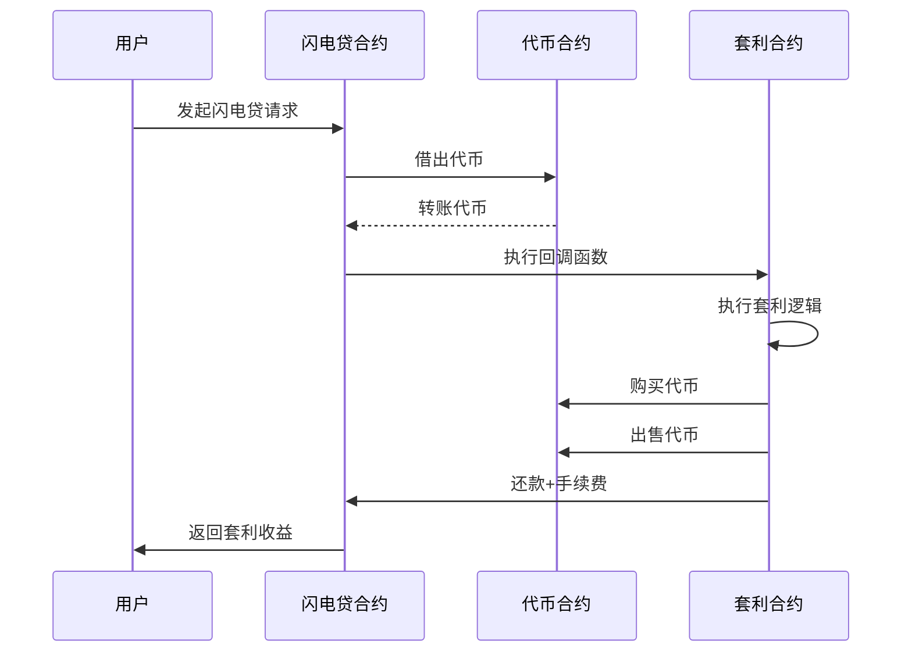
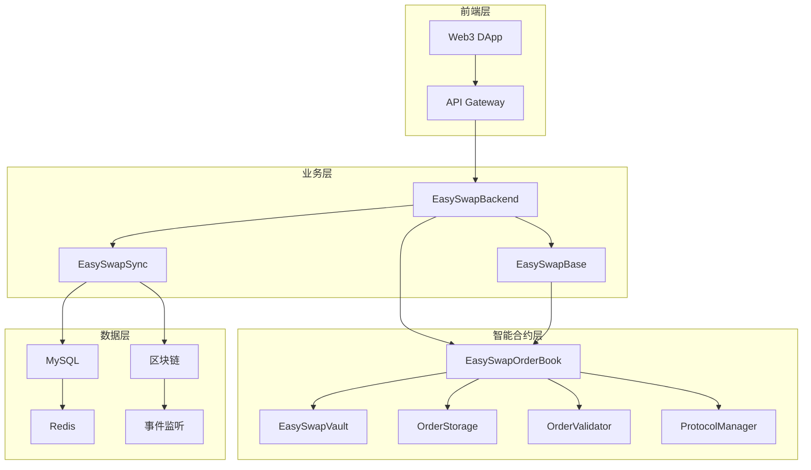

# Uniswap与EasySwap技术深度分析

## 目录
1. [Uniswap V2 vs V3 深度对比](#1-uniswap-v2-vs-v3-深度对比)
2. [闪电贷机制详解](#2-闪电贷机制详解)
3. [EasySwap项目架构分析](#3-easyswap项目架构分析)
4. [高并发高可用设计](#4-高并发高可用设计)
5. [技术对比与总结](#5-技术对比与总结)

---

## 1. Uniswap V2 vs V3 深度对比

### 1.1 核心架构差异

#### Uniswap V2 架构
```solidity
// V2 核心：恒定乘积公式
contract UniswapV2Pair {
    uint112 private reserve0;
    uint112 private reserve1;
    uint32  private blockTimestampLast;
    
    // 恒定乘积公式: x * y = k
    function getAmountOut(uint amountIn, uint reserveIn, uint reserveOut) 
        public pure returns (uint amountOut) {
        require(amountIn > 0, 'UniswapV2Library: INSUFFICIENT_INPUT_AMOUNT');
        require(reserveIn > 0 && reserveOut > 0, 'UniswapV2Library: INSUFFICIENT_LIQUIDITY');
        uint amountInWithFee = amountIn.mul(997);
        uint numerator = amountInWithFee.mul(reserveOut);
        uint denominator = reserveIn.mul(1000).add(amountInWithFee);
        amountOut = numerator / denominator;
    }
}
```

**特点：**
- 单一价格曲线：x * y = k
- 全价格区间流动性
- 0.3% 固定手续费
- 简单的AMM模型

#### Uniswap V3 架构
```solidity
// V3 核心：集中流动性
contract UniswapV3Pool {
    struct Slot0 {
        uint160 sqrtPriceX96;
        int24 tick;
        uint16 observationIndex;
        uint16 observationCardinality;
        uint16 observationCardinalityNext;
        uint8 feeProtocol;
        bool unlocked;
    }
    
    // 集中流动性：L = sqrt(x * y)
    function getAmount0ForLiquidity(
        uint160 sqrtRatioAX96,
        uint160 sqrtRatioBX96,
        uint128 liquidity
    ) internal pure returns (uint256 amount0) {
        if (sqrtRatioAX96 > sqrtRatioBX96) (sqrtRatioAX96, sqrtRatioBX96) = (sqrtRatioBX96, sqrtRatioAX96);
        return FullMath.mulDiv(liquidity, sqrtRatioBX96 - sqrtRatioAX96, Q96);
    }
}
```

**特点：**
- 集中流动性：LP可选择价格区间
- 多费率：0.05%, 0.3%, 1%
- 资本效率提升4000倍
- 复杂的tick系统

### 1.2 流动性管理对比

#### V2 流动性管理
```solidity
// V2: 全价格区间流动性
function mint(address to) external lock returns (uint liquidity) {
    (uint112 _reserve0, uint112 _reserve1,) = getReserves();
    uint balance0 = IERC20(token0).balanceOf(address(this));
    uint balance1 = IERC20(token1).balanceOf(address(this));
    uint amount0 = balance0.sub(_reserve0);
    uint amount1 = balance1.sub(_reserve1);
    
    uint _totalSupply = totalSupply;
    if (_totalSupply == 0) {
        liquidity = Math.sqrt(amount0.mul(amount1)).sub(MINIMUM_LIQUIDITY);
    } else {
        liquidity = Math.min(amount0.mul(_totalSupply) / _reserve0, amount1.mul(_totalSupply) / _reserve1);
    }
}
```

#### V3 流动性管理
```solidity
// V3: 集中流动性管理
function mint(
    address recipient,
    int24 tickLower,
    int24 tickUpper,
    uint128 amount,
    bytes calldata data
) external override lock returns (uint256 amount0, uint256 amount1) {
    require(amount > 0);
    (amount0, amount1) = _modifyPosition(
        ModifyPositionParams({
            owner: recipient,
            tickLower: tickLower,
            tickUpper: tickUpper,
            liquidityDelta: int256(amount)
        })
    );
}
```

### 1.3 价格发现机制

#### V2 价格发现
- **简单但低效**：全价格区间流动性分散
- **滑点较大**：大额交易影响价格
- **资本利用率低**：大量资金在无效价格区间

#### V3 价格发现
- **高效集中**：LP选择活跃价格区间
- **滑点更小**：集中流动性减少滑点
- **资本效率高**：相同资金提供更多流动性

### 1.4 手续费机制

#### V2 手续费
```solidity
// 固定0.3%手续费
uint amountInWithFee = amountIn.mul(997);
uint numerator = amountInWithFee.mul(reserveOut);
uint denominator = reserveIn.mul(1000).add(amountInWithFee);
```

#### V3 手续费
```solidity
// 多级手续费：0.05%, 0.3%, 1%
uint24 public constant FEE_LOW = 500;    // 0.05%
uint24 public constant FEE_MEDIUM = 3000; // 0.3%
uint24 public constant FEE_HIGH = 10000;  // 1%
```

---

## 2. 闪电贷机制详解

### 2.1 闪电贷核心原理

```solidity
contract FlashLoanProvider {
    function flashLoan(
        address token,
        uint256 amount,
        bytes calldata data
    ) external {
        uint256 balanceBefore = IERC20(token).balanceOf(address(this));
        
        // 1. 借出资金
        IERC20(token).transfer(msg.sender, amount);
        
        // 2. 执行回调函数
        IFlashLoanReceiver(msg.sender).executeOperation(token, amount, data);
        
        // 3. 验证还款
        uint256 balanceAfter = IERC20(token).balanceOf(address(this));
        require(balanceAfter >= balanceBefore, "Flash loan not repaid");
    }
}
```

### 2.2 闪电贷执行流程



### 2.3 闪电贷应用场景

#### 套利交易
```solidity
contract ArbitrageBot {
    function executeOperation(
        address token,
        uint256 amount,
        bytes calldata data
    ) external {
        // 1. 在DEX A购买代币
        swapOnDEXA(token, amount);
        
        // 2. 在DEX B出售代币
        uint256 profit = swapOnDEXB(token, amount);
        
        // 3. 还款
        IERC20(token).transfer(msg.sender, amount + fee);
        
        // 4. 保留利润
        IERC20(token).transfer(owner, profit - fee);
    }
}
```

#### 债务重组
```solidity
contract DebtRefinancing {
    function executeOperation(
        address token,
        uint256 amount,
        bytes calldata data
    ) external {
        // 1. 用闪电贷资金偿还高利率债务
        repayHighInterestDebt(amount);
        
        // 2. 借入低利率资金
        borrowLowInterestFunds(amount);
        
        // 3. 还款
        IERC20(token).transfer(msg.sender, amount + fee);
    }
}
```

### 2.4 闪电贷风险控制

```solidity
contract SafeFlashLoan {
    modifier onlyFlashLoan() {
        require(msg.sender == address(this), "Only flash loan");
        _;
    }
    
    function flashLoan(address token, uint256 amount) external {
        uint256 balanceBefore = IERC20(token).balanceOf(address(this));
        
        // 执行闪电贷
        IERC20(token).transfer(msg.sender, amount);
        IFlashLoanReceiver(msg.sender).executeOperation(token, amount, "");
        
        // 验证还款
        uint256 balanceAfter = IERC20(token).balanceOf(address(this));
        require(balanceAfter >= balanceBefore + fee, "Insufficient repayment");
    }
}
```

---

## 3. EasySwap项目架构分析

### 3.1 整体架构设计



### 3.2 核心合约分析

#### EasySwapOrderBook 核心功能
```solidity
contract EasySwapOrderBook {
    // 订单管理
    function makeOrders(LibOrder.Order[] calldata newOrders) external payable;
    function cancelOrders(OrderKey[] calldata orderKeys) external;
    function editOrders(LibOrder.EditDetail[] calldata editDetails) external payable;
    
    // 订单匹配
    function matchOrder(LibOrder.Order calldata sellOrder, LibOrder.Order calldata buyOrder) external payable;
    function matchOrders(LibOrder.MatchDetail[] calldata matchDetails) external payable;
    
    // 批量操作支持
    function batchMatchOrders() external payable;
}
```

#### EasySwapVault 资产托管
```solidity
contract EasySwapVault {
    // ETH 管理
    function depositETH(OrderKey orderKey, uint256 ETHAmount) external payable;
    function withdrawETH(OrderKey orderKey, uint256 ETHAmount, address to) external;
    
    // NFT 管理
    function depositNFT(OrderKey orderKey, address from, address collection, uint256 tokenId) external;
    function withdrawNFT(OrderKey orderKey, address to, address collection, uint256 tokenId) external;
    
    // 订单编辑支持
    function editETH(OrderKey oldOrderKey, OrderKey newOrderKey, uint256 oldETHAmount, uint256 newETHAmount, address to) external payable;
    function editNFT(OrderKey oldOrderKey, OrderKey newOrderKey) external;
}
```

### 3.3 订单数据结构

```solidity
struct Order {
    Side side;           // List(卖) 或 Bid(买)
    SaleKind saleKind;   // FixedPriceForItem 或 FixedPriceForCollection
    address maker;       // 订单创建者
    Asset nft;          // NFT 信息
    Price price;        // 价格
    uint64 expiry;      // 过期时间
    uint64 salt;        // 随机数
}

struct Asset {
    uint256 tokenId;    // Token ID
    address collection; // 合约地址
    uint96 amount;      // 数量
}
```

### 3.4 订单匹配算法

```solidity
function _matchOrder(
    LibOrder.Order calldata sellOrder,
    LibOrder.Order calldata buyOrder,
    uint256 msgValue
) internal returns (uint128 costValue) {
    // 1. 验证订单匹配条件
    _isMatchAvailable(sellOrder, buyOrder, sellOrderKey, buyOrderKey);
    
    // 2. 处理卖方订单
    if (_msgSender() == sellOrder.maker) {
        // 接受出价
        uint128 fillPrice = Price.unwrap(buyOrder.price);
        _updateFilledAmount(sellOrder.nft.amount, sellOrderKey);
        _updateFilledAmount(filledAmount[buyOrderKey] + 1, buyOrderKey);
        
        // 转移资产
        IEasySwapVault(_vault).withdrawETH(buyOrderKey, fillPrice, address(this));
        uint128 protocolFee = _shareToAmount(fillPrice, protocolShare);
        sellOrder.maker.safeTransferETH(fillPrice - protocolFee);
        IEasySwapVault(_vault).withdrawNFT(sellOrderKey, buyOrder.maker, sellOrder.nft.collection, sellOrder.nft.tokenId);
    }
    // 3. 处理买方订单...
}
```

---

## 4. 高并发高可用设计

### 4.1 后端架构设计

#### 微服务架构
```go
// EasySwapBackend 服务架构
type Server struct {
    config     *config.Config
    logger     *logger.Logger
    db         *gorm.DB
    redis      *redis.Client
    ethClient  *ethclient.Client
    orderBook  *contracts.EasySwapOrderBook
}

// 服务启动
func (s *Server) Start() error {
    // 1. 初始化数据库连接池
    if err := s.initDB(); err != nil {
        return err
    }
    
    // 2. 初始化Redis连接池
    if err := s.initRedis(); err != nil {
        return err
    }
    
    // 3. 初始化以太坊客户端
    if err := s.initEthClient(); err != nil {
        return err
    }
    
    // 4. 启动HTTP服务器
    return s.startHTTPServer()
}
```

#### 数据库连接池配置
```go
// 高并发数据库配置
func (s *Server) initDB() error {
    db, err := gorm.Open(mysql.Open(dsn), &gorm.Config{
        Logger: logger.Default.LogMode(logger.Info),
        // 连接池配置
        ConnPool: &sql.DB{
            MaxOpenConns:    100,  // 最大打开连接数
            MaxIdleConns:    10,   // 最大空闲连接数
            ConnMaxLifetime: time.Hour, // 连接最大生存时间
        },
    })
    
    // 配置读写分离
    db.Use(dbresolver.Register(dbresolver.Config{
        Sources:  []gorm.Dialector{mysql.Open(readDSN)},
        Replicas: []gorm.Dialector{mysql.Open(writeDSN)},
        Policy:   dbresolver.RandomPolicy{},
    }))
    
    return nil
}
```

### 4.2 缓存策略设计

#### Redis 缓存架构
```go
// 多级缓存策略
type CacheManager struct {
    localCache  *cache.Cache
    redisClient *redis.Client
}

// 缓存策略
func (c *CacheManager) Get(key string) (interface{}, error) {
    // 1. 先查本地缓存
    if value, found := c.localCache.Get(key); found {
        return value, nil
    }
    
    // 2. 再查Redis缓存
    if value, err := c.redisClient.Get(ctx, key).Result(); err == nil {
        c.localCache.Set(key, value, 5*time.Minute)
        return value, nil
    }
    
    // 3. 最后查数据库
    return c.getFromDB(key)
}
```

#### 缓存更新策略
```go
// 缓存更新策略
func (c *CacheManager) UpdateOrder(orderID string, order *Order) error {
    // 1. 更新数据库
    if err := c.db.Save(order).Error; err != nil {
        return err
    }
    
    // 2. 删除相关缓存
    c.localCache.Delete(orderID)
    c.redisClient.Del(ctx, orderID)
    
    // 3. 发布缓存更新事件
    c.publishCacheUpdate("order_updated", orderID)
    
    return nil
}
```

### 4.3 异步处理设计

#### 事件驱动架构
```go
// 事件处理器
type EventProcessor struct {
    eventChan chan *Event
    workers   int
}

func (ep *EventProcessor) Start() {
    for i := 0; i < ep.workers; i++ {
        go ep.worker()
    }
}

func (ep *EventProcessor) worker() {
    for event := range ep.eventChan {
        switch event.Type {
        case "order_created":
            ep.handleOrderCreated(event)
        case "order_matched":
            ep.handleOrderMatched(event)
        case "order_cancelled":
            ep.handleOrderCancelled(event)
        }
    }
}
```

#### 消息队列设计
```go
// 消息队列配置
type MessageQueue struct {
    producer *kafka.Producer
    consumer *kafka.Consumer
}

func (mq *MessageQueue) PublishOrderEvent(event *OrderEvent) error {
    message := &kafka.Message{
        Topic: "order_events",
        Key:   []byte(event.OrderID),
        Value: event.ToJSON(),
    }
    
    return mq.producer.Produce(message, nil)
}
```

### 4.4 负载均衡设计

#### 负载均衡器配置
```yaml
# Nginx 负载均衡配置
upstream easyswap_backend {
    least_conn;
    server 127.0.0.1:8080 weight=3 max_fails=3 fail_timeout=30s;
    server 127.0.0.1:8081 weight=3 max_fails=3 fail_timeout=30s;
    server 127.0.0.1:8082 weight=3 max_fails=3 fail_timeout=30s;
}

server {
    listen 80;
    location / {
        proxy_pass http://easyswap_backend;
        proxy_set_header Host $host;
        proxy_set_header X-Real-IP $remote_addr;
        proxy_set_header X-Forwarded-For $proxy_add_x_forwarded_for;
        
        # 连接超时配置
        proxy_connect_timeout 5s;
        proxy_send_timeout 60s;
        proxy_read_timeout 60s;
    }
}
```

#### 服务发现
```go
// 服务注册与发现
type ServiceRegistry struct {
    etcdClient *clientv3.Client
    services   map[string][]string
}

func (sr *ServiceRegistry) Register(serviceName, serviceAddr string) error {
    key := fmt.Sprintf("/services/%s/%s", serviceName, serviceAddr)
    _, err := sr.etcdClient.Put(context.Background(), key, serviceAddr)
    return err
}

func (sr *ServiceRegistry) Discover(serviceName string) ([]string, error) {
    resp, err := sr.etcdClient.Get(context.Background(), 
        fmt.Sprintf("/services/%s/", serviceName), 
        clientv3.WithPrefix())
    if err != nil {
        return nil, err
    }
    
    var addresses []string
    for _, kv := range resp.Kvs {
        addresses = append(addresses, string(kv.Value))
    }
    return addresses, nil
}
```

### 4.5 数据库优化设计

#### 读写分离
```go
// 读写分离配置
type DatabaseManager struct {
    masterDB *gorm.DB
    slaveDBs []*gorm.DB
    currentSlave int
}

func (dm *DatabaseManager) Write(query string, args ...interface{}) error {
    return dm.masterDB.Exec(query, args...).Error
}

func (dm *DatabaseManager) Read(query string, args ...interface{}) (*sql.Rows, error) {
    // 轮询选择从库
    slave := dm.slaveDBs[dm.currentSlave]
    dm.currentSlave = (dm.currentSlave + 1) % len(dm.slaveDBs)
    
    return slave.Raw(query, args...).Rows()
}
```

#### 分库分表策略
```go
// 分表策略
func (dm *DatabaseManager) getTableName(orderID string) string {
    // 根据订单ID哈希分表
    hash := crc32.ChecksumIEEE([]byte(orderID))
    tableIndex := hash % 10
    return fmt.Sprintf("orders_%d", tableIndex)
}

func (dm *DatabaseManager) CreateOrder(order *Order) error {
    tableName := dm.getTableName(order.ID)
    return dm.masterDB.Table(tableName).Create(order).Error
}
```

### 4.6 监控与告警设计

#### 监控指标
```go
// 监控指标收集
type MetricsCollector struct {
    prometheus prometheus.Registry
}

func (mc *MetricsCollector) RecordOrderCreated() {
    orderCreatedCounter.Inc()
}

func (mc *MetricsCollector) RecordOrderMatched(duration time.Duration) {
    orderMatchDuration.Observe(duration.Seconds())
}

func (mc *MetricsCollector) RecordAPIRequest(endpoint string, statusCode int, duration time.Duration) {
    apiRequestDuration.WithLabelValues(endpoint, strconv.Itoa(statusCode)).Observe(duration.Seconds())
}
```

#### 健康检查
```go
// 健康检查端点
func (s *Server) healthCheck(c *gin.Context) {
    health := map[string]interface{}{
        "status": "healthy",
        "timestamp": time.Now().Unix(),
        "services": map[string]string{
            "database": s.checkDatabase(),
            "redis": s.checkRedis(),
            "ethereum": s.checkEthereum(),
        },
    }
    
    c.JSON(200, health)
}

func (s *Server) checkDatabase() string {
    if err := s.db.Raw("SELECT 1").Error; err != nil {
        return "unhealthy"
    }
    return "healthy"
}
```

---

## 5. 技术对比与总结

### 5.1 Uniswap vs EasySwap 对比

| 特性 | Uniswap V2 | Uniswap V3 | EasySwap |
|------|------------|------------|----------|
| **交易类型** | 代币交换 | 代币交换 | NFT交易 |
| **流动性模型** | 全价格区间 | 集中流动性 | 订单簿模式 |
| **价格发现** | AMM自动做市 | AMM+集中流动性 | 订单匹配 |
| **资本效率** | 低 | 高 | 中等 |
| **复杂度** | 简单 | 复杂 | 中等 |
| **Gas消耗** | 中等 | 高 | 中等 |

### 5.2 高并发设计总结

#### 1. 架构层面
- **微服务架构**：服务拆分，独立部署
- **负载均衡**：多实例部署，流量分发
- **服务发现**：动态服务注册与发现

#### 2. 数据层面
- **读写分离**：主从数据库，读写分离
- **分库分表**：水平扩展，性能提升
- **缓存策略**：多级缓存，减少数据库压力

#### 3. 应用层面
- **异步处理**：事件驱动，消息队列
- **连接池**：数据库连接池，HTTP连接池
- **批量操作**：减少网络开销

#### 4. 监控层面
- **指标监控**：Prometheus + Grafana
- **日志聚合**：ELK Stack
- **链路追踪**：Jaeger/Zipkin

### 5.3 技术选型建议

#### 对于NFT交易平台
1. **订单簿模式**：适合NFT交易，价格发现更准确
2. **资产托管**：Vault模式，安全性更高
3. **批量操作**：支持批量创建、匹配订单
4. **事件驱动**：实时更新，用户体验更好

#### 对于高并发系统
1. **微服务架构**：易于扩展和维护
2. **缓存策略**：Redis + 本地缓存
3. **数据库优化**：读写分离 + 分库分表
4. **异步处理**：消息队列 + 事件驱动

### 5.4 未来发展方向

#### 技术演进
1. **Layer 2 集成**：Polygon、Arbitrum等
2. **跨链支持**：多链NFT交易
3. **AI优化**：智能订单匹配
4. **零知识证明**：隐私保护交易

#### 性能优化
1. **Gas优化**：更高效的合约设计
2. **批量处理**：减少交易数量
3. **预计算**：提前计算复杂逻辑
4. **缓存优化**：更智能的缓存策略

---

## 结论

通过深入分析Uniswap和EasySwap的技术架构，我们可以看到：

1. **Uniswap V3**通过集中流动性大幅提升了资本效率，但增加了系统复杂度
2. **EasySwap**采用订单簿模式，更适合NFT交易场景
3. **高并发高可用**需要从架构、数据、应用、监控多个层面进行设计
4. **技术选型**应该根据具体业务场景和需求来决定

这些技术方案为构建高性能的DeFi和NFT交易平台提供了重要的参考和指导。
