# 区块链账户模型可视化图表

## 1. UTXO模型结构图

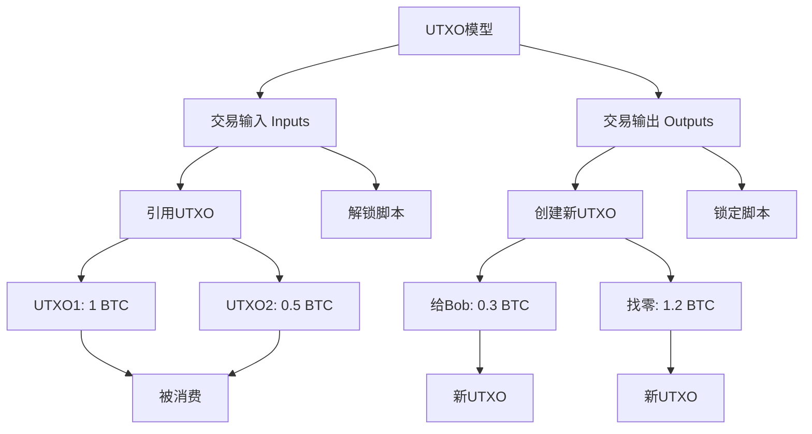

## 2. 以太坊账户生成流程图

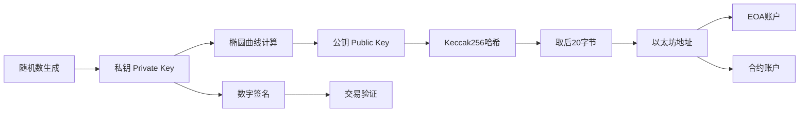

## 3. 公私钥关系图

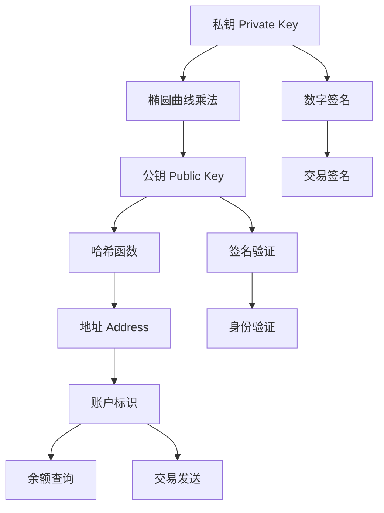

## 4. UTXO vs 账户模型对比

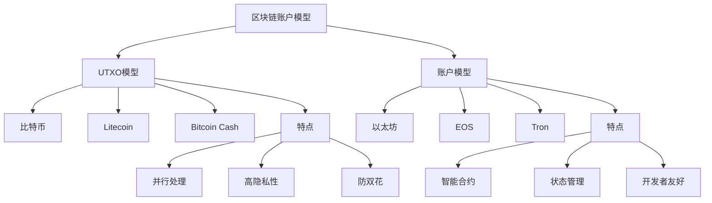

## 5. 交易生命周期对比

### UTXO交易生命周期
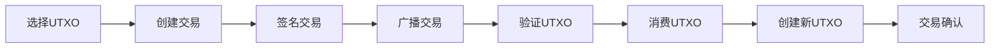

### 以太坊交易生命周期
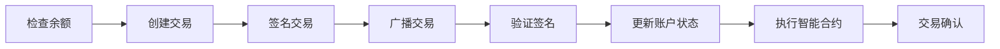

## 6. 地址生成过程对比

### 比特币地址生成
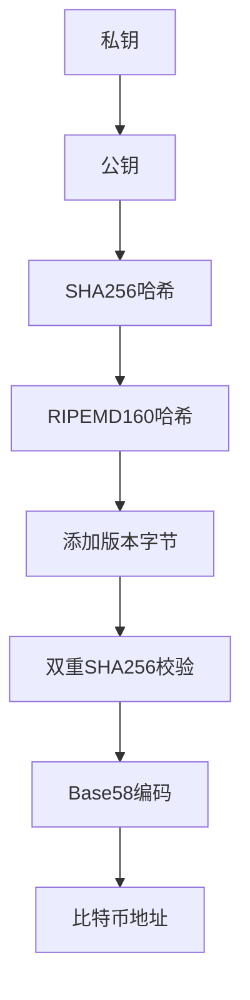

### 以太坊地址生成
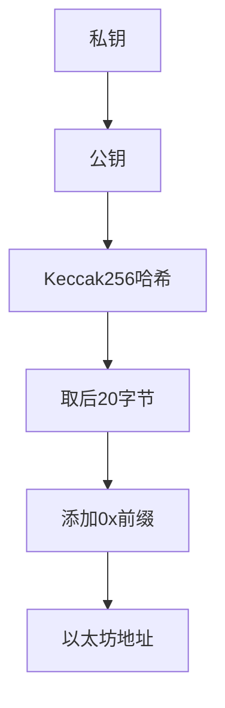

## 7. 安全机制对比

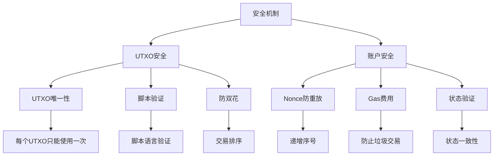

## 8. 智能合约支持对比

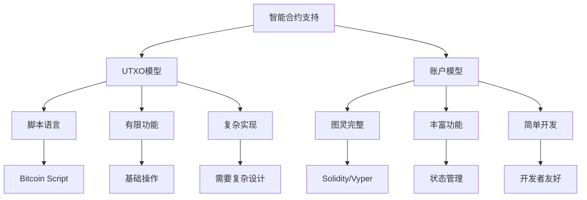

## 9. 性能对比

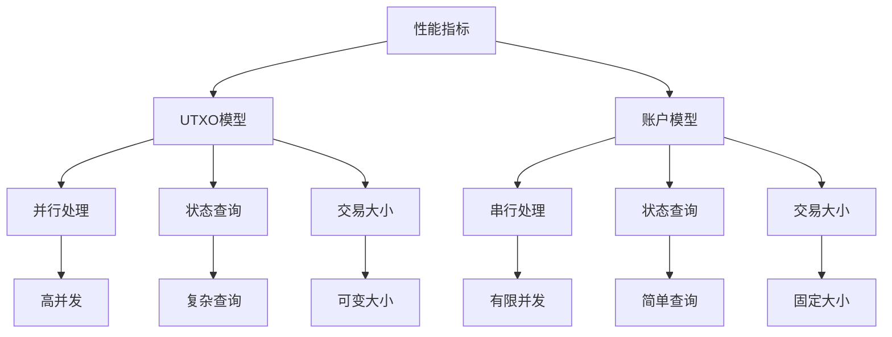

## 10. 实际应用场景

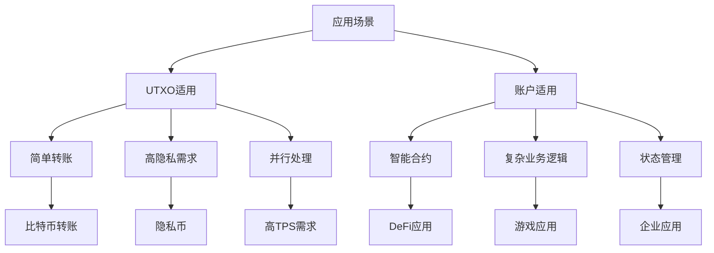

这些图表展示了UTXO模型和账户模型的核心差异，以及它们在区块链系统中的不同应用场景。理解这些概念对于选择合适的区块链平台和开发策略至关重要。
