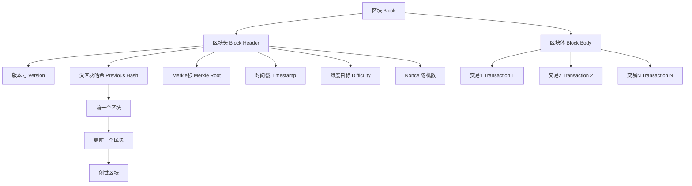
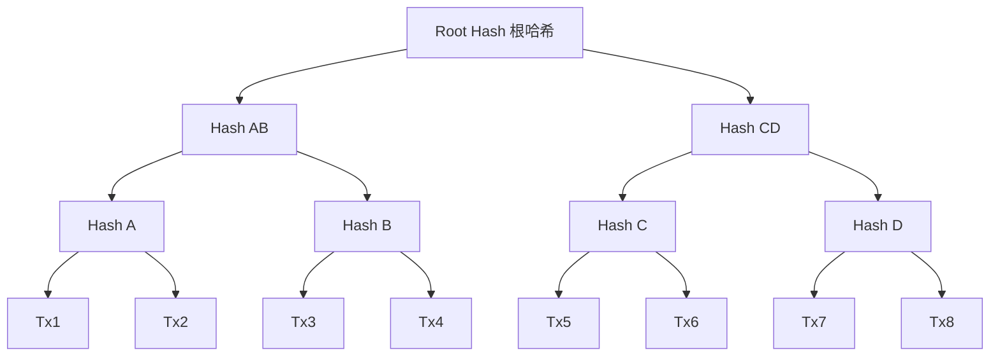
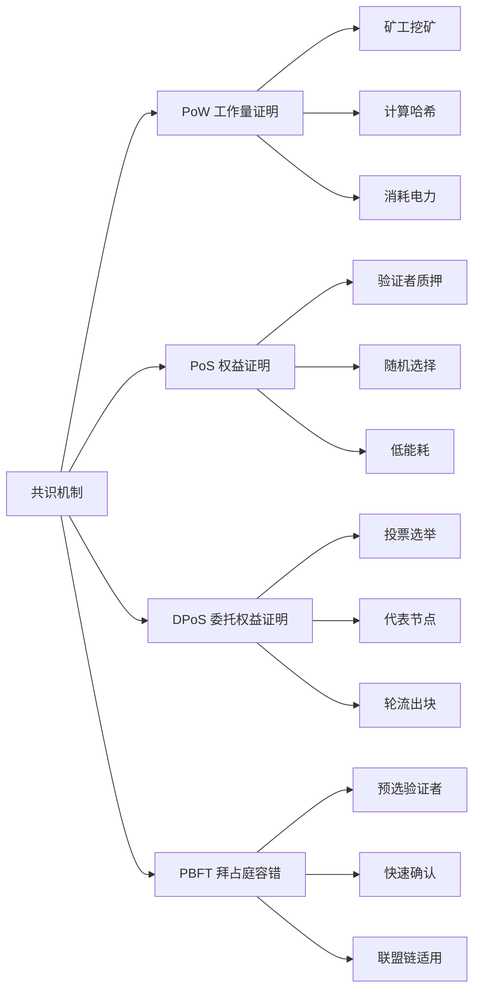
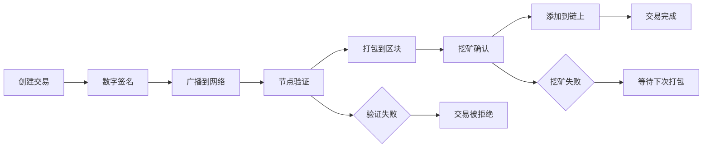
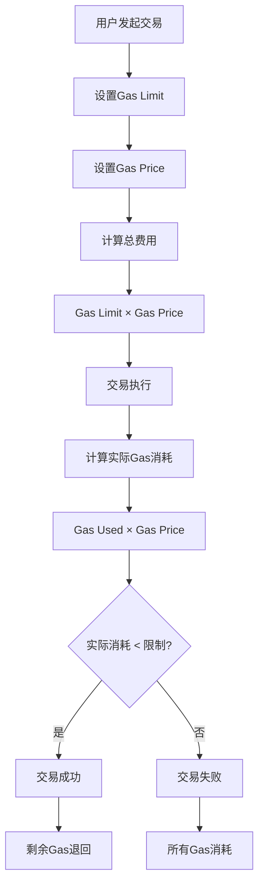
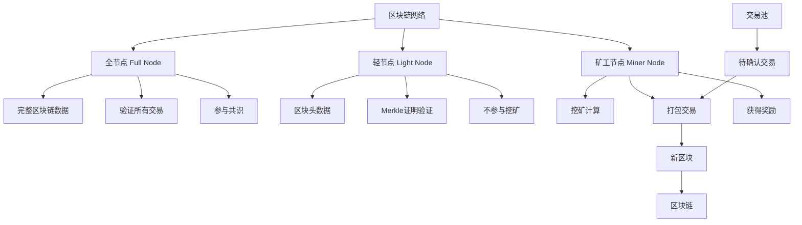
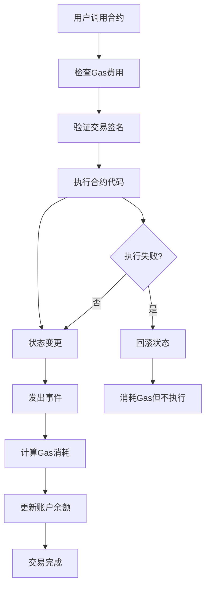
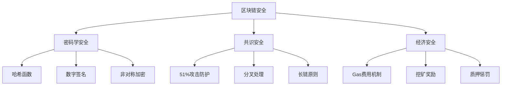

# 区块链核心概念关系图

## 1. 区块结构图

```mermaid
graph TD
    A[区块 Block] --> B[区块头 Block Header]
    A --> C[区块体 Block Body]
    
    B --> D[版本号 Version]
    B --> E[父区块哈希 Previous Hash]
    B --> F[Merkle根 Merkle Root]
    B --> G[时间戳 Timestamp]
    B --> H[难度目标 Difficulty]
    B --> I[Nonce 随机数]
    
    C --> J[交易1 Transaction 1]
    C --> K[交易2 Transaction 2]
    C --> L[交易N Transaction N]
    
    E --> M[前一个区块]
    M --> N[更前一个区块]
    N --> O[创世区块]
```

## 2. Merkle树结构图

```mermaid
graph TD
    A[Root Hash 根哈希] --> B[Hash AB]
    A --> C[Hash CD]
    
    B --> D[Hash A]
    B --> E[Hash B]
    C --> F[Hash C]
    C --> G[Hash D]
    
    D --> H[Tx1]
    D --> I[Tx2]
    E --> J[Tx3]
    E --> K[Tx4]
    F --> L[Tx5]
    F --> M[Tx6]
    G --> N[Tx7]
    G --> O[Tx8]
```

## 3. 共识机制对比图

```mermaid
graph LR
    A[共识机制] --> B[PoW 工作量证明]
    A --> C[PoS 权益证明]
    A --> D[DPoS 委托权益证明]
    A --> E[PBFT 拜占庭容错]
    
    B --> B1[矿工挖矿]
    B --> B2[计算哈希]
    B --> B3[消耗电力]
    
    C --> C1[验证者质押]
    C --> C2[随机选择]
    C --> C3[低能耗]
    
    D --> D1[投票选举]
    D --> D2[代表节点]
    D --> D3[轮流出块]
    
    E --> E1[预选验证者]
    E --> E2[快速确认]
    E --> E3[联盟链适用]
```

## 4. 交易生命周期图

```mermaid
graph LR
    A[创建交易] --> B[数字签名]
    B --> C[广播到网络]
    C --> D[节点验证]
    D --> E[打包到区块]
    E --> F[挖矿确认]
    F --> G[添加到链上]
    G --> H[交易完成]
    
    D --> I{验证失败}
    I --> J[交易被拒绝]
    
    F --> K{挖矿失败}
    K --> L[等待下次打包]
```

## 5. Gas费用计算流程图

```mermaid
graph TD
    A[用户发起交易] --> B[设置Gas Limit]
    B --> C[设置Gas Price]
    C --> D[计算总费用]
    D --> E[Gas Limit × Gas Price]
    
    E --> F[交易执行]
    F --> G[计算实际Gas消耗]
    G --> H[Gas Used × Gas Price]
    
    H --> I{实际消耗 < 限制?}
    I -->|是| J[交易成功]
    I -->|否| K[交易失败]
    
    J --> L[剩余Gas退回]
    K --> M[所有Gas消耗]
```

## 6. 区块链网络架构图

```mermaid
graph TB
    A[区块链网络] --> B[全节点 Full Node]
    A --> C[轻节点 Light Node]
    A --> D[矿工节点 Miner Node]
    
    B --> B1[完整区块链数据]
    B --> B2[验证所有交易]
    B --> B3[参与共识]
    
    C --> C1[区块头数据]
    C --> C2[Merkle证明验证]
    C --> C3[不参与挖矿]
    
    D --> D1[挖矿计算]
    D --> D2[打包交易]
    D --> D3[获得奖励]
    
    E[交易池] --> F[待确认交易]
    F --> D2
    D2 --> G[新区块]
    G --> H[区块链]
```

## 7. 智能合约执行流程图

```mermaid
graph TD
    A[用户调用合约] --> B[检查Gas费用]
    B --> C[验证交易签名]
    C --> D[执行合约代码]
    D --> E[状态变更]
    E --> F[发出事件]
    F --> G[计算Gas消耗]
    G --> H[更新账户余额]
    H --> I[交易完成]
    
    D --> J{执行失败?}
    J -->|是| K[回滚状态]
    J -->|否| E
    
    K --> L[消耗Gas但不执行]
```

## 8. 区块链安全机制图

```mermaid
graph TD
    A[区块链安全] --> B[密码学安全]
    A --> C[共识安全]
    A --> D[经济安全]
    
    B --> B1[哈希函数]
    B --> B2[数字签名]
    B --> B3[非对称加密]
    
    C --> C1[51%攻击防护]
    C --> C2[分叉处理]
    C --> C3[长链原则]
    
    D --> D1[Gas费用机制]
    D --> D2[挖矿奖励]
    D --> D3[质押惩罚]
```

这些图表展示了区块链核心概念之间的关系和交互，帮助理解整个系统的运作机制。
