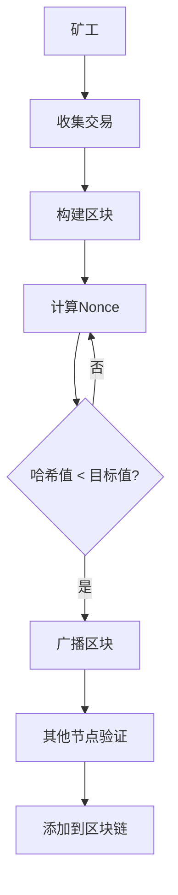
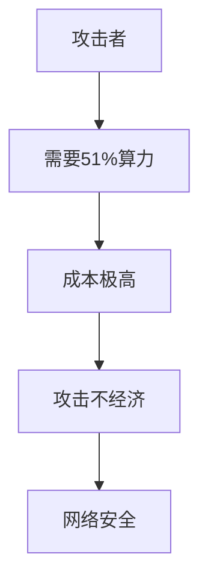
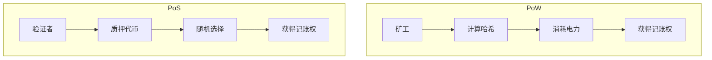

# 工作量证明（Proof of Work, PoW）详解

## 目录
1. [PoW基本概念](#1-pow基本概念)
2. [PoW工作原理](#2-pow工作原理)
3. [哈希函数与挖矿](#3-哈希函数与挖矿)
4. [PoW算法实现](#4-pow算法实现)
5. [PoW优缺点分析](#5-pow优缺点分析)
6. [PoW安全性分析](#6-pow安全性分析)
7. [PoW应用实例](#7-pow应用实例)
8. [PoW与其他共识机制对比](#8-pow与其他共识机制对比)
9. [PoW未来发展](#9-pow未来发展)

---

## 1. PoW基本概念

### 1.1 什么是工作量证明

工作量证明（Proof of Work, PoW）是一种分布式共识机制，要求网络参与者（矿工）通过消耗计算资源来解决一个数学难题，从而获得记账权。这是比特币等加密货币网络的核心机制。

### 1.2 PoW的核心思想



### 1.3 PoW的关键要素

- **计算难题**：需要大量计算资源才能解决
- **验证简单**：其他节点可以快速验证结果
- **随机性**：谁先找到解是随机的
- **成本性**：需要消耗真实的计算资源

---

## 2. PoW工作原理

### 2.1 基本流程

```solidity
// PoW基本流程伪代码
contract ProofOfWork {
    struct Block {
        uint256 previousHash;
        uint256 timestamp;
        bytes32 merkleRoot;
        uint256 nonce;
        uint256 difficulty;
    }
    
    function mineBlock(Block memory block) public pure returns (bool) {
        // 1. 计算区块哈希
        bytes32 blockHash = keccak256(abi.encodePacked(
            block.previousHash,
            block.timestamp,
            block.merkleRoot,
            block.nonce
        ));
        
        // 2. 检查是否满足难度要求
        return uint256(blockHash) < (2 ** (256 - block.difficulty));
    }
}
```

### 2.2 挖矿过程详解

#### 步骤1：交易收集
```go
// 矿工收集待确认交易
type Miner struct {
    mempool    *TransactionPool
    blockSize  int
}

func (m *Miner) collectTransactions() []Transaction {
    var transactions []Transaction
    
    // 按手续费排序，优先处理高手续费交易
    sortedTxs := m.mempool.GetSortedTransactions()
    
    for _, tx := range sortedTxs {
        if len(transactions) >= m.blockSize {
            break
        }
        transactions = append(transactions, tx)
    }
    
    return transactions
}
```

#### 步骤2：构建区块头
```go
// 构建区块头
type BlockHeader struct {
    PreviousHash  [32]byte
    MerkleRoot    [32]byte
    Timestamp     uint64
    Difficulty    uint32
    Nonce         uint32
}

func (m *Miner) buildBlockHeader(transactions []Transaction, previousBlock *Block) *BlockHeader {
    // 计算Merkle根
    merkleRoot := calculateMerkleRoot(transactions)
    
    return &BlockHeader{
        PreviousHash: previousBlock.Hash,
        MerkleRoot:   merkleRoot,
        Timestamp:    uint64(time.Now().Unix()),
        Difficulty:   m.calculateDifficulty(),
        Nonce:        0,
    }
}
```

#### 步骤3：寻找有效Nonce
```go
// 挖矿核心算法
func (m *Miner) mineBlock(header *BlockHeader) (*Block, error) {
    target := m.calculateTarget(header.Difficulty)
    
    for nonce := uint32(0); nonce < math.MaxUint32; nonce++ {
        header.Nonce = nonce
        
        // 计算区块哈希
        hash := m.calculateBlockHash(header)
        
        // 检查是否满足难度要求
        if bytes.Compare(hash[:], target) < 0 {
            // 找到有效解！
            return m.createBlock(header, hash), nil
        }
    }
    
    return nil, errors.New("mining failed")
}
```

### 2.3 难度调整机制

```go
// 难度调整算法
func (m *Miner) calculateDifficulty(blockHeight uint64) uint32 {
    // 每2016个区块调整一次难度
    if blockHeight%2016 != 0 {
        return m.currentDifficulty
    }
    
    // 计算前2016个区块的实际时间
    actualTime := m.getBlockTime(blockHeight-2016, blockHeight)
    expectedTime := 2016 * 10 * 60 // 10分钟 * 2016个区块
    
    // 调整难度
    if actualTime < expectedTime/2 {
        // 时间太短，增加难度
        return m.currentDifficulty + 1
    } else if actualTime > expectedTime*2 {
        // 时间太长，减少难度
        return m.currentDifficulty - 1
    }
    
    return m.currentDifficulty
}
```

---

## 3. 哈希函数与挖矿

### 3.1 SHA-256算法

```go
// SHA-256实现示例
func calculateSHA256(data []byte) [32]byte {
    hash := sha256.Sum256(data)
    return hash
}

// 双重SHA-256（比特币使用）
func doubleSHA256(data []byte) [32]byte {
    first := sha256.Sum256(data)
    second := sha256.Sum256(first[:])
    return second
}
```

### 3.2 挖矿难度计算

```go
// 难度目标计算
func calculateTarget(difficulty uint32) [32]byte {
    // 目标值 = 2^(256-difficulty)
    target := big.NewInt(1)
    target.Lsh(target, 256-uint(difficulty))
    
    var result [32]byte
    target.FillBytes(result[:])
    return result
}

// 检查哈希是否满足难度要求
func isHashValid(hash [32]byte, target [32]byte) bool {
    return bytes.Compare(hash[:], target[:]) < 0
}
```

### 3.3 Merkle树构建

```go
// Merkle树节点
type MerkleNode struct {
    Left  *MerkleNode
    Right *MerkleNode
    Hash  [32]byte
}

// 构建Merkle树
func buildMerkleTree(transactions []Transaction) *MerkleNode {
    if len(transactions) == 0 {
        return nil
    }
    
    if len(transactions) == 1 {
        return &MerkleNode{
            Hash: calculateTransactionHash(transactions[0]),
        }
    }
    
    // 递归构建左右子树
    mid := len(transactions) / 2
    left := buildMerkleTree(transactions[:mid])
    right := buildMerkleTree(transactions[mid:])
    
    // 计算父节点哈希
    combined := append(left.Hash[:], right.Hash[:]...)
    parentHash := doubleSHA256(combined)
    
    return &MerkleNode{
        Left:  left,
        Right: right,
        Hash:  parentHash,
    }
}
```

---

## 4. PoW算法实现

### 4.1 简单PoW实现

```solidity
// 简单的PoW合约实现
contract SimplePoW {
    struct Block {
        uint256 index;
        bytes32 previousHash;
        uint256 timestamp;
        bytes32 data;
        uint256 nonce;
        uint256 difficulty;
    }
    
    Block[] public blockchain;
    uint256 public difficulty = 4; // 前4位必须为0
    
    function mineBlock(bytes32 data) public {
        uint256 index = blockchain.length;
        bytes32 previousHash = index > 0 ? blockchain[index - 1].hash : bytes32(0);
        
        Block memory newBlock = Block({
            index: index,
            previousHash: previousHash,
            timestamp: block.timestamp,
            data: data,
            nonce: 0,
            difficulty: difficulty
        });
        
        // 寻找有效nonce
        while (!isValidProof(newBlock)) {
            newBlock.nonce++;
        }
        
        blockchain.push(newBlock);
    }
    
    function isValidProof(Block memory block) internal pure returns (bool) {
        bytes32 hash = keccak256(abi.encodePacked(
            block.index,
            block.previousHash,
            block.timestamp,
            block.data,
            block.nonce
        ));
        
        // 检查前difficulty位是否为0
        uint256 target = 2 ** (256 - block.difficulty);
        return uint256(hash) < target;
    }
    
    function getBlockHash(uint256 index) public view returns (bytes32) {
        require(index < blockchain.length, "Block does not exist");
        Block memory block = blockchain[index];
        
        return keccak256(abi.encodePacked(
            block.index,
            block.previousHash,
            block.timestamp,
            block.data,
            block.nonce
        ));
    }
}
```

### 4.2 优化版PoW实现

```go
// 优化版PoW实现
type OptimizedMiner struct {
    workers    int
    workChan   chan *MiningWork
    resultChan chan *MiningResult
}

type MiningWork struct {
    Header    *BlockHeader
    Target    [32]byte
    StartNonce uint32
    EndNonce   uint32
}

type MiningResult struct {
    Nonce uint32
    Hash  [32]byte
    Found bool
}

// 多线程挖矿
func (m *OptimizedMiner) startMining(header *BlockHeader, target [32]byte) {
    workSize := math.MaxUint32 / uint32(m.workers)
    
    for i := 0; i < m.workers; i++ {
        go m.worker(&MiningWork{
            Header:     header,
            Target:     target,
            StartNonce: uint32(i) * workSize,
            EndNonce:   uint32(i+1) * workSize,
        })
    }
}

func (m *OptimizedMiner) worker(work *MiningWork) {
    for nonce := work.StartNonce; nonce < work.EndNonce; nonce++ {
        work.Header.Nonce = nonce
        hash := m.calculateHash(work.Header)
        
        if bytes.Compare(hash[:], work.Target[:]) < 0 {
            m.resultChan <- &MiningResult{
                Nonce: nonce,
                Hash:  hash,
                Found: true,
            }
            return
        }
    }
    
    m.resultChan <- &MiningResult{Found: false}
}
```

### 4.3 ASIC抗性算法

```go
// Scrypt算法（Litecoin使用）
func scryptHash(data []byte, salt []byte, N, r, p, keyLen int) ([]byte, error) {
    return scrypt.Key(data, salt, N, r, p, keyLen)
}

// Ethash算法（以太坊使用）
type Ethash struct {
    dataset   []uint32
    cache     []uint32
    epoch     uint64
}

func (e *Ethash) hashimoto(hash []byte, nonce uint64) ([]byte, []byte) {
    // 生成种子
    seed := e.generateSeed(hash, nonce)
    
    // 计算mix
    mix := make([]byte, 128)
    copy(mix, hash)
    
    // 执行多轮计算
    for i := 0; i < 64; i++ {
        mix = e.fnvHash(mix, e.getDatasetItem(seed, i))
    }
    
    // 计算最终哈希
    result := e.finalHash(mix, hash, nonce)
    
    return result, mix
}
```

---

## 5. PoW优缺点分析

### 5.1 PoW优点

#### 安全性高


- **51%攻击成本高**：需要控制网络大部分算力
- **历史不可篡改**：修改历史区块需要重新计算所有后续区块
- **去中心化程度高**：任何人都可以参与挖矿

#### 公平性
- **机会均等**：所有矿工都有相同的成功概率
- **无预挖**：没有预先分配的代币
- **透明公开**：挖矿过程完全透明

### 5.2 PoW缺点

#### 能源消耗
```go
// 能源消耗计算
type EnergyConsumption struct {
    HashRate    float64 // 算力 (H/s)
    PowerUsage  float64 // 功耗 (W)
    Efficiency  float64 // 效率 (J/H)
}

func (ec *EnergyConsumption) calculateDailyConsumption() float64 {
    // 每日能源消耗 = 功耗 * 24小时
    return ec.PowerUsage * 24 // kWh
}

func (ec *EnergyConsumption) calculateAnnualConsumption() float64 {
    return ec.calculateDailyConsumption() * 365 // kWh/年
}
```

#### 中心化风险
- **ASIC矿机**：专业矿机导致普通用户无法参与
- **矿池集中**：少数大型矿池控制大部分算力
- **地理集中**：矿场集中在电力便宜的地区

#### 性能限制
- **交易确认慢**：需要等待区块确认
- **吞吐量低**：每秒只能处理有限交易
- **可扩展性差**：难以处理大规模交易

### 5.3 能源消耗统计

| 网络 | 年耗电量 (TWh) | 相当于 |
|------|----------------|--------|
| 比特币 | 150+ | 阿根廷全国用电量 |
| 以太坊 | 100+ | 菲律宾全国用电量 |
| 总计 | 250+ | 澳大利亚全国用电量 |

---

## 6. PoW安全性分析

### 6.1 攻击类型分析

#### 51%攻击
```go
// 51%攻击检测
type AttackDetector struct {
    blockchain *Blockchain
    threshold  float64 // 51%
}

func (ad *AttackDetector) detect51Attack() bool {
    // 计算最大矿池算力占比
    maxPoolHashrate := ad.getMaxPoolHashrate()
    totalHashrate := ad.getTotalHashrate()
    
    ratio := float64(maxPoolHashrate) / float64(totalHashrate)
    
    return ratio > ad.threshold
}

func (ad *AttackDetector) getMaxPoolHashrate() uint64 {
    // 获取最大矿池算力
    pools := ad.getMiningPools()
    max := uint64(0)
    
    for _, pool := range pools {
        if pool.Hashrate > max {
            max = pool.Hashrate
        }
    }
    
    return max
}
```

#### 双花攻击
```go
// 双花攻击检测
func (ad *AttackDetector) detectDoubleSpending(tx *Transaction) bool {
    // 检查同一UTXO是否被多次使用
    spentOutputs := ad.getSpentOutputs(tx.Inputs)
    
    for _, output := range spentOutputs {
        if ad.isOutputSpent(output) {
            return true // 检测到双花
        }
    }
    
    return false
}
```

### 6.2 安全机制

#### 最长链规则
```go
// 最长链选择
func (bc *Blockchain) selectLongestChain() {
    chains := bc.getAllChains()
    longest := chains[0]
    
    for _, chain := range chains[1:] {
        if len(chain) > len(longest) {
            longest = chain
        }
    }
    
    bc.mainChain = longest
}
```

#### 检查点机制
```go
// 检查点验证
type Checkpoint struct {
    Height    uint64
    BlockHash [32]byte
    Timestamp uint64
}

func (bc *Blockchain) validateCheckpoint(block *Block) bool {
    checkpoints := bc.getCheckpoints()
    
    for _, cp := range checkpoints {
        if block.Height == cp.Height {
            return bytes.Equal(block.Hash[:], cp.BlockHash[:])
        }
    }
    
    return true
}
```

---

## 7. PoW应用实例

### 7.1 比特币PoW

```go
// 比特币PoW实现
type BitcoinPoW struct {
    targetBits uint32
    maxNonce   uint32
}

func (bp *BitcoinPoW) mineBlock(header *BlockHeader) (*Block, error) {
    target := bp.calculateTarget(bp.targetBits)
    
    for nonce := uint32(0); nonce < bp.maxNonce; nonce++ {
        header.Nonce = nonce
        hash := bp.doubleSHA256(header)
        
        if bytes.Compare(hash[:], target[:]) < 0 {
            return &Block{
                Header: header,
                Hash:   hash,
            }, nil
        }
    }
    
    return nil, errors.New("mining timeout")
}

func (bp *BitcoinPoW) calculateTarget(bits uint32) [32]byte {
    // 目标值 = 0x00000000FFFF0000000000000000000000000000000000000000000000000000
    // 根据bits调整
    exponent := bits >> 24
    mantissa := bits & 0x00ffffff
    
    target := big.NewInt(int64(mantissa))
    target.Lsh(target, 8*(exponent-3))
    
    var result [32]byte
    target.FillBytes(result[:])
    return result
}
```

### 7.2 以太坊PoW (Ethash)

```go
// 以太坊Ethash算法
type Ethash struct {
    dataset   []uint32
    cache     []uint32
    epoch     uint64
}

func (e *Ethash) mine(header *BlockHeader, difficulty *big.Int) (*Block, error) {
    target := new(big.Int).Div(maxUint256, difficulty)
    
    for nonce := uint64(0); nonce < maxNonce; nonce++ {
        header.Nonce = nonce
        hash, mix := e.hashimoto(header.Hash(), nonce)
        
        if new(big.Int).SetBytes(hash).Cmp(target) <= 0 {
            return &Block{
                Header: header,
                Hash:   hash,
                Mix:    mix,
            }, nil
        }
    }
    
    return nil, errors.New("mining failed")
}
```

### 7.3 Litecoin PoW (Scrypt)

```go
// Litecoin Scrypt算法
type ScryptPoW struct {
    n, r, p, keyLen int
}

func (sp *ScryptPoW) mine(header *BlockHeader, difficulty uint32) (*Block, error) {
    target := sp.calculateTarget(difficulty)
    
    for nonce := uint32(0); nonce < maxNonce; nonce++ {
        header.Nonce = nonce
        hash := sp.scryptHash(header)
        
        if bytes.Compare(hash, target) < 0 {
            return &Block{
                Header: header,
                Hash:   hash,
            }, nil
        }
    }
    
    return nil, errors.New("mining failed")
}

func (sp *ScryptPoW) scryptHash(header *BlockHeader) []byte {
    data := header.Serialize()
    hash, _ := scrypt.Key(data, data, sp.n, sp.r, sp.p, sp.keyLen)
    return hash
}
```

---

## 8. PoW与其他共识机制对比

### 8.1 共识机制对比表

| 特性 | PoW | PoS | DPoS | PBFT |
|------|-----|-----|------|------|
| **能源消耗** | 极高 | 低 | 低 | 低 |
| **去中心化** | 高 | 中 | 低 | 中 |
| **安全性** | 高 | 中 | 中 | 高 |
| **性能** | 低 | 中 | 高 | 高 |
| **公平性** | 高 | 中 | 低 | 中 |
| **可扩展性** | 低 | 中 | 高 | 中 |

### 8.2 PoW vs PoS



#### PoW优势
- **无需质押**：不需要持有代币即可参与
- **历史验证**：通过计算成本证明历史
- **抗女巫攻击**：计算成本阻止虚假身份

#### PoS优势
- **节能环保**：不需要大量计算资源
- **性能更高**：更快的确认时间
- **经济激励**：持币者参与治理

### 8.3 混合共识机制

```go
// 混合PoW+PoS实现
type HybridConsensus struct {
    powWeight  float64 // PoW权重
    posWeight  float64 // PoS权重
    validators map[address]uint64 // 验证者质押
}

func (hc *HybridConsensus) selectValidator(block *Block) address {
    // 50% PoW + 50% PoS
    if rand.Float64() < 0.5 {
        return hc.selectPoWValidator(block)
    } else {
        return hc.selectPoSValidator()
    }
}

func (hc *HybridConsensus) selectPoWValidator(block *Block) address {
    // 选择挖出区块的矿工
    return block.Miner
}

func (hc *HybridConsensus) selectPoSValidator() address {
    // 根据质押数量随机选择
    totalStake := hc.getTotalStake()
    random := rand.Uint64() % totalStake
    
    cumulative := uint64(0)
    for addr, stake := range hc.validators {
        cumulative += stake
        if random < cumulative {
            return addr
        }
    }
    
    return address(0)
}
```

---

## 9. PoW未来发展

### 9.1 技术改进方向

#### 绿色挖矿
```go
// 绿色挖矿算法
type GreenMining struct {
    renewableEnergy bool
    carbonNeutral   bool
    efficiency      float64
}

func (gm *GreenMining) calculateCarbonFootprint() float64 {
    if gm.renewableEnergy {
        return 0.0 // 使用可再生能源
    }
    
    // 计算碳排放
    return gm.efficiency * 0.5 // kg CO2/kWh
}
```

#### ASIC抗性改进
```go
// 内存硬算法
type MemoryHardPoW struct {
    memorySize int
    iterations int
}

func (mh *MemoryHardPoW) mine(header *BlockHeader) (*Block, error) {
    // 需要大量内存的算法
    memory := make([]byte, mh.memorySize)
    
    for nonce := uint32(0); nonce < maxNonce; nonce++ {
        header.Nonce = nonce
        
        // 执行内存密集型计算
        hash := mh.memoryIntensiveHash(header, memory)
        
        if mh.isValidHash(hash) {
            return &Block{Header: header, Hash: hash}, nil
        }
    }
    
    return nil, errors.New("mining failed")
}
```

### 9.2 新兴PoW变种

#### 时空证明 (Proof of Space-Time)
```go
// 时空证明实现
type ProofOfSpaceTime struct {
    storageSize int64
    timePeriod  time.Duration
}

func (post *ProofOfSpaceTime) generateProof(data []byte) []byte {
    // 在指定时间内使用存储空间计算
    start := time.Now()
    result := make([]byte, 32)
    
    for time.Since(start) < post.timePeriod {
        // 使用存储空间进行计算
        result = post.storageIntensiveHash(data, result)
    }
    
    return result
}
```

#### 有用工作量证明 (Proof of Useful Work)
```go
// 有用工作量证明
type ProofOfUsefulWork struct {
    usefulTask string
    difficulty uint32
}

func (pouw *ProofOfUsefulWork) mine(header *BlockHeader) (*Block, error) {
    for nonce := uint32(0); nonce < maxNonce; nonce++ {
        header.Nonce = nonce
        
        // 执行有用的计算任务
        usefulResult := pouw.performUsefulTask(header)
        hash := pouw.calculateHash(header, usefulResult)
        
        if pouw.isValidHash(hash) {
            return &Block{
                Header: header,
                Hash:   hash,
                Data:   usefulResult,
            }, nil
        }
    }
    
    return nil, errors.New("mining failed")
}
```

### 9.3 行业趋势

#### 1. 能源效率提升
- **可再生能源**：使用太阳能、风能等清洁能源
- **废热利用**：利用挖矿产生的废热供暖
- **能效优化**：改进算法减少能源消耗

#### 2. 硬件专业化
- **ASIC矿机**：专门设计的挖矿硬件
- **GPU挖矿**：图形处理器并行计算
- **FPGA挖矿**：可编程逻辑器件

#### 3. 算法创新
- **抗ASIC算法**：防止算力中心化
- **内存硬算法**：增加内存需求
- **有用工作量**：将算力用于实际计算

---

## 总结

工作量证明（PoW）作为区块链技术的核心共识机制，具有以下特点：

### 核心优势
1. **安全性高**：通过计算成本保证网络安全
2. **去中心化**：任何人都可以参与挖矿
3. **公平性**：机会均等，无预挖
4. **历史不可篡改**：修改历史成本极高

### 主要挑战
1. **能源消耗**：大量电力消耗引发环保担忧
2. **中心化风险**：ASIC矿机和矿池集中
3. **性能限制**：交易确认慢，吞吐量低
4. **可扩展性**：难以处理大规模交易

### 发展方向
1. **绿色挖矿**：使用可再生能源，提高能效
2. **算法创新**：开发更公平、更高效的算法
3. **混合共识**：结合多种共识机制的优势
4. **硬件优化**：开发更高效的挖矿硬件

PoW虽然面临挑战，但其安全性和去中心化特性使其在区块链领域仍然具有重要价值。随着技术的发展和创新，PoW将继续演进，为区块链网络提供更安全、更高效的共识机制。
